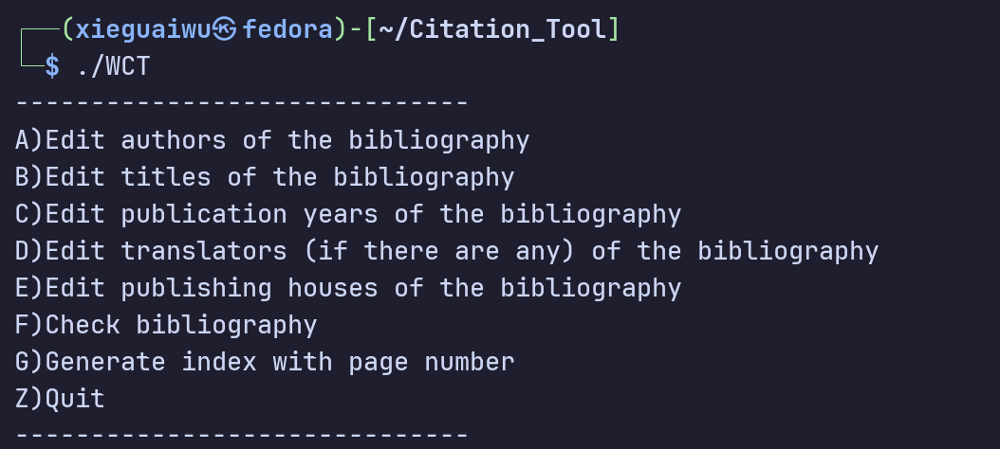
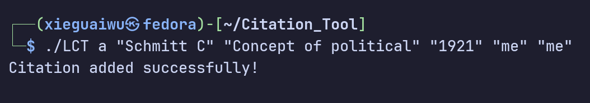

# Citation_Tool

> [!WARNING]
> This is a beginner's project.

A terminal-based minimalist reference management tool for APA format written in C++, **runs on both Windows and Linux**

---

## Features
There are two kinds of user interface: **WCT** and **LCT**.
1. **WCT**: having an interface using keyboard keys to navigate, suitable for muti-window performance 
2. **LCT**: traditional pure text API

### LCT-Usage
Usage: LCT <command> [options] 
Commands: 
  add/a <author> <title> <year> [translator] [publisher]] 
  list/l [index]] 
  delete/d <index>] 
  clear/c] 
  export/e <filename> [format=APA]] 
  help/h] 

---

## Screenshots
1. **WCT**

2. **LCT**

